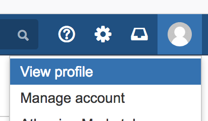
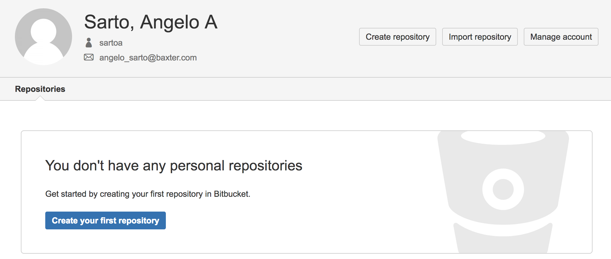
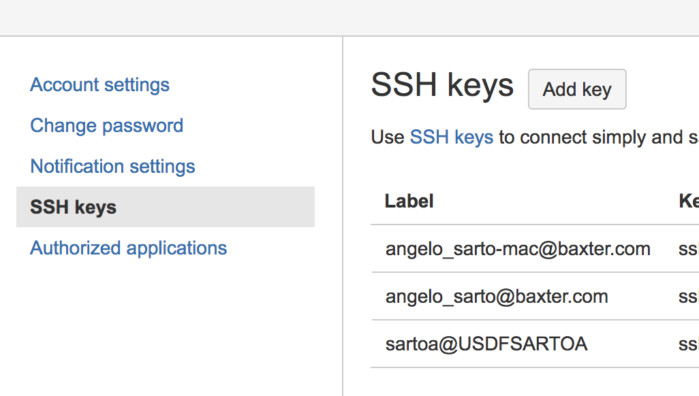

@title[Get Gud Git]
# @fa[magic] Get  @fa[bomb] Gud  @ Git @fa[code-fork]
---
Getting Good at Git
Note:
this presentation will give you enough understanding of how git works to make you confident to look up the things you know and to never feel stuck.

---
## @fa[cogs] Setup @fa[bitbucket]
https://bitbucket.aws.baxter.com

@div[left-25]

@divend
@div[left-25]

@divend
@div[left-25]

@divend
`cat ~/.ssh/id_rsa.pub`
Note:
First up, we are going to establish a personal repo to play around in while I do this presentation.  I expect you to fidget in class; but I expect you to fidget on git.
