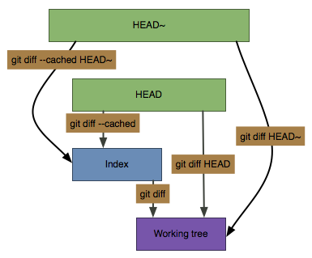
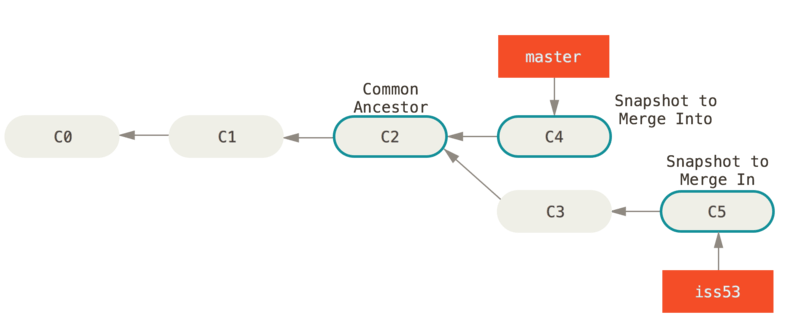
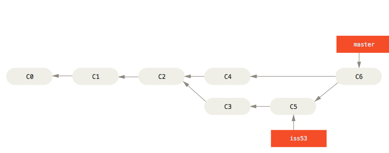

# My Scratch Repo for experimentation

## Setting up SSH Keys
`cat ~/.ssh/id_rsa.pub`
1. Add your ssh key to bitbucket (Only has to be done once per machine)
    1. Login to [Baxter's Bitbucket server](https://bitbucket.aws.baxter.com/)
    1. In the upper right corner click on the profile icon and choose _Manage Account_
    1. On the left choose _SSH Keys_
    1. Click _Add Key_
    1. On your local machine open the file ` ~/.ssh/id_rsa.pub` and copy the contents of this file
        1.  It will look like this `ssh-rsa AAAAB3NzaC1y ...QPQ== email@baxter.com`
    1. Paste the contents of this file into the box and click _Add Key_

## Git Basic Terms aka the three trees plus 2
workspace/working directory/working tree  -  the file system directory that you normally see
index/cached/staged/staging - the virtual directory that you are grouping together to form a commit.
local repo - The committed code in the repository contains all of the committed hashes and tags. e.g. HEAD, master, etc.
remote repository / "origin" - a remote copy of the committed code. often named "origin" but you can have multiples
stash - a special
### Workspace

## All the important git commands in 2 pictures

[Source](http://patrickzahnd.ch/blog.html#gittransport)


[Source](http://365git.tumblr.com/post/3464927214/getting-a-diff-between-the-working-tree-and-other)

### git diff
my summary of the git diff command is this: `git diff a b`
compare a to b.  by default a is the workspace, and b is the cached(stage/index) as in show me what is not currently in the draft commit.  a and/or b can be commit hashes/tags/etc (including HEAD).  If you want to make the comparison base the cached (potential commit) then you add --staged or --cached (they are the same)

### quick saving a copy (stash)
this is a way to quickly save you working copy if you need to go work on something and then go back.  Simply, `git stash` places your working copy in a copy and then resets the working directory to HEAD.  to git it back after you are done `git stash pop`

### undoing changes
1. git checkout - replace your working copy with what is in the local repository   **This command is destructive to the local copy**  If you want to preserve our local copy *and* undo the change then you might want stash first.
1. git reset HEAD file - this un-stages a file. This is usually non-destructive.  Except when you have a change you staged, and another local change and you want to keep the staged one but remove the local change.  In this case `git checkout file` will change your local to match your staged (as opposed to `git checkout HEAD` which will make your local the same as the committed HEAD)
  1. Reset in general is non-destructive in that the commits are not lost; HOWEVER, resetting with commits that have already been pushed can cause other clients to be in weird state.

## Branching
To understand git branching and why it is "fast/cheap" and effective we can show just a bit of the git internals.

Git's commit structure is a small text file with references to other commits, trees (file lists) and blobs (files.)

In git a branch (and tags, though stored separately) are simply pointers to the commit files (which are actually on your file system with the name of the hash) so when you work it looks like this:


To know what is currently the checked out branch (what your local copy is based on) git keeps a pointer called HEAD.  So when you make a new commit the following happens:

  1. calculate the hashes for everything in stage(index) including building recursive tree structures if needed.
  1. create a new commit hash record for the total commit that points at the parent commit and the tree created above. At this point the branch pointer and HEAD move to the new commit.

(Note: remember detached HEAD?  this means that your current work directory points at a commit but does not have a branch; because of this the branch pointer cannot move forward meaning you shouldn't commit against a detached head)

Now that you see how git tracks commits - creating a branch basically costs nothing, it is adding a small pointer file.  It does take a little more time to switch your local copy to the branch in that the files have to be modified to the correct state but this is also pretty darn fast as all of the versions of that file exist in git's cache (actually these are patch files which keeps them small and fast)

To create a branch you use `git branch BRANCH_NAME` which creates a pointer to the same place that HEAD currently is at.   you can then switch to the branch by doing `git checkout BRANCH_NAME` or to simplify and do both of these together just do `git checkout -b BRANCH_NAME`

You can base a branch at any point, instead of just head.  just add the commit hash, tag or branch you want to base it on on the end of the above command, e.g. `git checkout -b v1.1-hotfix v1.1` will find the tag/branch named v1.1 create a branch based on this commit and switch to it.

### Merging
Once you have been developing for a while, you eventually have to bring those branches back together.  One thing to note here is this:
**Checkout the branch you are merging into and merge in the other branch.**
usually this means
```
git checkout master
git merge other_branch
```
git will try to make the merge as easy as possible by selecting the common ancestor and only comparing the parts that both have changed.  It will then make a commit that is the result of the merge.  If there are no conflicts that it cannot figure out it will make the commit and move the branch (and HEAD too) forward without any input from you.

these two diagrams summarize this:



if there are files git cannot merge automatically it will leave the files in your directory marked with typical diff marks
```
<<<<<<<<<
changed in the file merging into.
===========
changed in the file merging in.
>>>>>>>>>
```
keep the lines you want (possibly both) and delete the <<<, ===, and >>> markers.  You can also use the intelliJ / pycharm diff tool to merge these visually.

when you are done you need to add the files using `git add filename` until there are no more files to resolve.  When completed with merging you tell git you are done by doing `git commit` this creates the merge commit.


## Git commands I used while creating this Repo

1. show configuration `git config --list`
1. edit my configuration `git config --global user.name=Angelo Sarto` `git config --global user.email=angelo_sarto@baxter.com`
1. set line endings `git config --global core.autocrlf input` `git config --global core.safecrlf true`
1. set a different editor (atom in this example) if you don't like your current editor `git config --global core.editor "atom --wait"` it checks these configurations (in order)
  1. GIT_EDITOR environment variable
  1. core.editor configuration setting
  1. VISUAL environment variable
  1. EDITOR environment variable
  Note: you can clear git config params using this `git config --global --unset core.editor `
1. by default git will pipe log commands through your selected pager (usually configured as less on most systems.  I like less to auto exit if it fits on one screen so I add `export less=-FRX` to my zshrc / bashrc file.)
1. to show what you have checked out, e.g. where am I, you can use `git rev-parse HEAD` or `git show --oneline -s`
1. git log shows the committed history.  git reflog shows git actions taken.
