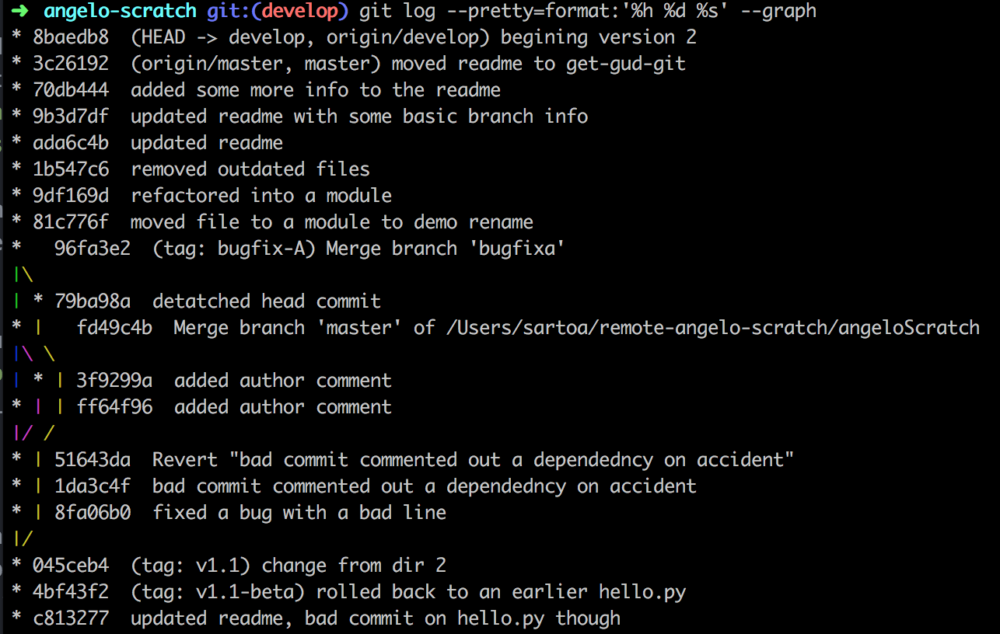

# My Scratch Repo for experimentation

## Setting up SSH Keys
`cat ~/.ssh/id_rsa.pub`
1. Add your ssh key to bitbucket (Only has to be done once per machine)
    1. Login to [Baxter's Bitbucket server](https://bitbucket.aws.baxter.com/)
    1. In the upper right corner click on the profile icon and choose _Manage Account_
    1. On the left choose _SSH Keys_
    1. Click _Add Key_
    1. On your local machine open the file ` ~/.ssh/id_rsa.pub` and copy the contents of this file
        1.  It will look like this `ssh-rsa AAAAB3NzaC1y ...QPQ== email@baxter.com`
    1. Paste the contents of this file into the box and click _Add Key_

## Git Basic Terms aka the three trees plus 2
workspace/working directory/working tree  -  the file system directory that you normally see
index/cached/staged/staging - the virtual directory that you are grouping together to form a commit.
local repo - The committed code in the repository contains all of the committed hashes and tags. e.g. HEAD, master, etc.
remote repository / "origin" - a remote copy of the committed code. often named "origin" but you can have multiples
stash - a special

## Git Basics - Splitting your work
### Repositories
A repository should map to a releasable project.  This is the fuzziest definition, in some ways its easier to just talk about when it might be wrong. You should consider splitting when:
- If part of the repo is shared as a library, but part isn't.
- If different modules should have different lead maintainers (owners)
- If commits in the project often seem unrelated (lots of unnecessary merges)
You should consider joining repositories together when:
- You create a branch with the same name in two different repositories to try and group your work. (aka you need to coordinate pushes to not break things)
- A shared module is only used by one other repository
### Branches (and Tags)
A branch should map to a deliverable feature or group of features.  In general, this will map to a story, issue, or bug.  You should get in the habit of making a branch for every issue (with the possible exception if the change is so small that a single commit will be easy and make sense.  A branch serves as a placeholder and bookmark for your current thought process.  Leaving the master branch as stable allows you to quickly jump back to that point and run experiments/ideas.  Thinking of this in ML projects - you might be working on importing new data from a source file and while it is in progress you have a conversation with someone that gives you an idea that you could try with the existing data - simply switching branches allows you to change and try this out.  Git makes the mental context switch to be the only thing that is difficult - the source control context switch is easy.

A tag is simply a permanent bookmark in the history.  It should be used for releases and to mark important stages in the project - such as when some major feature is working well, etc.
### Commits
A Commit is the smallest unit of work.  Make a lot of them, basically if you make a code change and it works then make a commit.  It is tempting to always rely on your IDE's undo/redo, but once you get used to committing often you will be able to read the git log and see why you made each small change.  If you are worried that too many commits look "bad", don't worry you can squash them together later (especially if committing to public/GitHub projects.)

## All the important git commands in 2 pictures

[Source](http://patrickzahnd.ch/blog.html#gittransport)


[Source](http://365git.tumblr.com/post/3464927214/getting-a-diff-between-the-working-tree-and-other)

### Git basic commands
I won't describe the commands in the diagrams above (add, remove, commit, push, pull, etc.) their online documentation and help is sufficient.  Just remember that what you want to do is change one of the databases in this picture; find the thing you want to change and look through the commands that touch it.   Unless you want to "undo" something, in which case then see the section below.  

### Undoing changes
1. git checkout - replace your working copy with what is in the local repository   **This command is destructive to the local copy**  If you want to preserve our local copy *and* undo the change then you might want stash first.
1. git reset HEAD file - this un-stages a file. This is usually non-destructive.  Except when you have a change you staged, and another local change and you want to keep the staged one but remove the local change.  In this case `git checkout file` will change your local to match your staged (as opposed to `git checkout HEAD` which will make your local the same as the committed HEAD)
  1. Reset in general is non-destructive in that the commits are not lost; HOWEVER, resetting with commits that have already been pushed can cause other clients to be in weird state.

### *git*-ting help
You can always google and stackoverflow - but the [free git book](https://www.git-scm.com/book) is actually really well written and I have used it a lot to create these slides. For quick references too if you use `man git-subcommand` you will almost always find some answer for tweaking your output/format. (e.g. `man git-log` and `man git-rebase`)

## "Level 2" git commands
### ammending a commit
This happens often enough that I just wanted to copy/paste a bit from the git book here:
Changing your most recent commit is probably the most common rewriting of history that you’ll do. You’ll often want to do two basic things to your last commit: simply change the commit message, or change the actual content of the commit by adding, removing and modifying files.
If you simply want to modify your last commit message, that’s easy: `git commit --amend` The command above loads the previous commit message into an editor session, where you can make changes to the message, save those changes and exit. When you save and close the editor, the editor writes a new commit containing that updated commit message and makes it your new last commit. If, on the other hand, you want to change the actual content of your last commit, the process works basically the same way — first make the changes you think you forgot, stage those changes, and the subsequent `git commit --amend` replaces that last commit with your new, improved commit.

You need to be careful with this technique because amending changes the SHA-1 of the commit. It’s like a very small rebase — don’t amend your last commit if you’ve already pushed it.

### git log, describe, show, reflog show
First git log.  log shows the history of what is in your repository. it defaults to just showing history that is on your current branch.  The most important tip here is just to use the -<number> option to limit output, e.g. `git log -3` will show the most recent 3 commits on your current branch.  If you want to see the latest 3 commits across all branches you can include the all option: `git log -3 --all`.

*Note:* quick sidebar here, at some point you will really want your own git log format.  For me, that is this one `git log --pretty=format:'%h %d %s' --graph` which outputs like this 
You can create a alias for this in your ~/.gitconfig like this:
```
# some content above ...
[alias]
        l = log --pretty=format:'%h %d %s' --graph
# some content below ...
```
You can find more formatting ideas [here](https://git-scm.com/docs/pretty-formats)

If you want more detail about a specific commit including the diff it introduced and other information, you use `git show <commit>` the commit can be a hash, tag, branch, or a references. The default is `git show HEAD`, but you can specify other things, such as a different branch `git show develop` while you are on master. You can also refer to the parent of a commit using the ^ ~ syntax, e.g. `git show v1.1^` will show the parent commit of the tag v1.1, i.e. the commit before the commit that had tag v1.1.  the difference between ^ and ~ is one that will be discussed a bit later when we talk about diffing.  Finally, git show has some neat tricks too, in that you can quick look at a file from any particular commit without checking anything out -- e.g. `git show 9b3d7df:module1/greeter.py` will show the file contents of the module1/greeter.py file as of the commit 9b3d7df.

Sometimes you want a more human readable way to describe the current commit, this often comes up in build scripts for example.  `git describe` shows the latest tag followed by the number of commits since the tag followed by a partial hash; e.g. `v1.1-16-g8baedb8` this is tag `v1.1` plus `16` commits, it is also the commit that has hash `g8baedb8`.

Finally, the reflog command, shows your local history of actions - not just commits, but switching between branches, stashing, etc.  Its more like a terminal command history or a undo/redo log.  `git reflog -10` will show the last 10 actions you took.

### git diff (is not always the tool you want)
When you want a difference between things in git there are two parts to what you want to show.
  1. the most important, obviously, is the difference between which two (or more) things.  
  1. secondly, what do you want to show as the difference - do you just want a summary or do you want to show line by line detail.

If you just want to see the commit messages/hashes that are different between two branches the tool you actually want is probably `git log ada6c4b..70db444` this means show the commits that are in 70db444 but not in ada6c4b.  If these are on the same path then reversing the order produces no output because every change in 70db444 is in ada6c4b.  This can get more interesting when comparing divergent branches `git log 79ba98a..fd49c4b` and `git log fd49c4b..79ba98a` because both references have changes not in the other.  
The .. notation is shorthand for `git log ^79ba98a fd49c4b` or `git log fd49c4b --not 79ba98a`.  You can specify as many references (commits, branches, tags) so you can see what commits are in any of several branches that are not in the other ref you specify.

Another useful trick option is the ... syntax.  This shows everything reachable by either but not both, `git log 79ba98a...fd49c4b --left-right --oneline`

git diff is for comparing your staging or working copies to other things - be it each other, or to other branches or commits.  Diff is used to determine the difference of uncommitted work to committed work.

My summary of the git diff command is this: `git diff a b`
compare a to b.  by default a is the workspace, and b is the cached(stage/index) as in show me what is not currently in the draft commit.  a and/or b can be commit hashes/tags/etc (including HEAD).  If you want to make the comparison base the cached (potential commit) then you add --staged or --cached (they are the same)

### quick saving a copy (stash)

Stash is like a multi-clipboard for your working directory (and your index if you want.)

This is a way to quickly save you working copy if you need to go work on something and then go back.  Simply, `git stash` (the default command is push) places your working copy in a stack and then resets the working directory to HEAD.  To get back to where you were after you are done `git stash pop` -- or --  `git stash apply`  followed by `git stash drop`

### Searching
git has it's own grep command: `git grep`  Why would you ever use this, when we already have grep?  Because we can grep any point in history specifically.  E.g. `git grep somestring v1.1-beta` will search for somestring in the version as it existed for tag(or branch) v1.1-beta.

The other useful search is to see when something was modified/introduced -- e.g. when did we add this constant or function.  `git log -S Greeter` will show all of the commits where the number of Greeter occurrences changed, i.e. the String was added for the first time or referenced.  (if a referenced was added and removed in the same commit then the occurrences would balance out, so it won't show up).   The output of this (or more specifically `git log -S Greeter --oneline`) will return a hash, e.g. 9df169d.   You can then see exactly what changed using this: `git diff 9df169d^ 9df169d`  Remember from our discussion above about commit references that adding the ^ means parent; therefore this diffs the commit where it was added and the one before it.

## Branching
To understand git branching and why it is "fast/cheap" and effective we can show just a bit of the git internals.

Git's commit structure is a small text file with references to other commits, trees (file lists) and blobs (files.)

In git a branch (and tags, though stored separately) are simply pointers to the commit files (which are actually on your file system with the name of the hash) so when you work it looks like this:


To know what is currently the checked out branch (what your local copy is based on) git keeps a pointer called HEAD.  So when you make a new commit the following happens:

  1. calculate the hashes for everything in stage(index) including building recursive tree structures if needed.
  1. create a new commit hash record for the total commit that points at the parent commit and the tree created above. At this point the branch pointer and HEAD move to the new commit.

(Note: remember detached HEAD?  this means that your current work directory points at a commit but does not have a branch; because of this the branch pointer cannot move forward meaning you shouldn't commit against a detached head)

Now that you see how git tracks commits - creating a branch basically costs nothing, it is adding a small pointer file.  It does take a little more time to switch your local copy to the branch in that the files have to be modified to the correct state but this is also pretty darn fast as all of the versions of that file exist in git's cache (actually these are patch files which keeps them small and fast)

To create a branch you use `git branch BRANCH_NAME` which creates a pointer to the same place that HEAD currently is at.   you can then switch to the branch by doing `git checkout BRANCH_NAME` or to simplify and do both of these together just do `git checkout -b BRANCH_NAME`

You can base a branch at any point, instead of just head.  just add the commit hash, tag or branch you want to base it on on the end of the above command, e.g. `git checkout -b v1.1-hotfix v1.1` will find the tag/branch named v1.1 create a branch based on this commit and switch to it.

### Remote branches
By default branches are *_NOT_* pushed to remote servers(unless you pulled them from the remote)  The branches you create locally are yours unless you *explicitly* push them.  Branches you pull, however are *tracked* meaning they link to the remote branch, so they can/will be pushed.  You can see the remote branches using the `git remote show origin` command (origin in this case is likely what you call your remote - if you don't you will probably already know this :) )

### Merging
Once you have been developing for a while, you eventually have to bring those branches back together.  One thing to note here is this:
**Checkout the branch you are merging into and merge in the other branch.**
usually this means
```
git checkout master
git merge other_branch
```
git will try to make the merge as easy as possible by selecting the common ancestor and only comparing the parts that both have changed.  It will then make a commit that is the result of the merge.  If there are no conflicts that it cannot figure out it will make the commit and move the branch (and HEAD too) forward without any input from you.

these two diagrams summarize this:


if there are files git cannot merge automatically it will leave the files in your directory marked with typical diff marks
```
<<<<<<<<<
changed in the file merging into.
===========
changed in the file merging in.
>>>>>>>>>
```
keep the lines you want (possibly both) and delete the <<<, ===, and >>> markers.  You can also use the intelliJ / pycharm diff tool to merge these visually.

when you are done you need to add the files using `git add filename` until there are no more files to resolve.  When completed with merging you tell git you are done by doing `git commit` this creates the merge commit.

### Rebase vs. merge
Merging creates a new commit showing the combination of the 2 branches.  Rebasing re-writes (by creating new commits and deleting the old ones) on the target branch as if they origionally descending from the

### Branching Workflows
Because git branching is fast and (relatively) easy many projects create long-lived branches where 'master' is the last stable release and there are several development and feature branches for in-progress work.  I won't discuss much here as the choice can be argued over almost endlessly; instead I just want to point it out.

The only point I want to make is that if you really want to get gud @ git, you should branch all the time.   Have a new idea, create a branch.  Fixing a bug, create a branch.  once you get used to doing it a lot, it becomes easier to navigate around into multiple states and you don't have to do this:
- undo
- undo
- undo
- undo
- undo
- copy
- redo
- redo
- redo
- paste

## Git commands I used while creating this Repo

1. show configuration `git config --list`
1. edit my configuration `git config --global user.name=Angelo Sarto` `git config --global user.email=angelo_sarto@baxter.com`
1. set line endings `git config --global core.autocrlf input` `git config --global core.safecrlf true`
1. set a different editor (atom in this example) if you don't like your current editor `git config --global core.editor "atom --wait"` it checks these configurations (in order)
  1. GIT_EDITOR environment variable
  1. core.editor configuration setting
  1. VISUAL environment variable
  1. EDITOR environment variable
  Note: you can clear git config params using this `git config --global --unset core.editor `
1. by default git will pipe log commands through your selected pager (usually configured as less on most systems.  I like less to auto exit if it fits on one screen so I add `export less=-FRX` to my zshrc / bashrc file.)
1. to show what you have checked out, e.g. where am I, you can use `git rev-parse HEAD` or `git show --oneline -s`
1. git log shows the committed history.  git reflog shows git actions taken. reflog is like the shell history - it is local and ephemeral
1. show the latest tag followed by the number of commits since the tag followed by a partial hash `git describe`
1. make a zip file where all the files are prefixed with source and the name is generated form git describe.
```
git archive master --prefix='src' --format=zip > `git describe master`.zip
```
